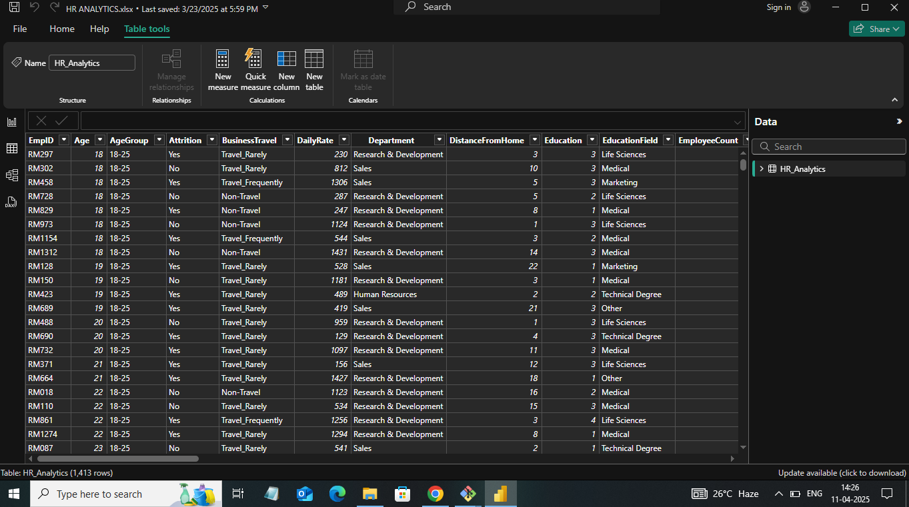

# HR Analytics Dashboard – Power BI

## 📊 Project Overview

The **HR Analytics Dashboard** is a data visualization project created using Power BI. It helps in analyzing various HR-related metrics like employee distribution, attrition, salary, job roles, education, and age. The goal of this dashboard is to support HR teams and business stakeholders in understanding trends and making informed decisions.

> **Created by:** Archana Gautam

---

## 🎯 Objective

To analyze and visualize HR data to answer key questions such as:
- How many employees are there in each department?
- What is the average salary and age of employees?
- How many employees have left (attrition) or joined?
- What are their education levels and job roles?
- What is the attrition trend by gender, salary, age, education, and job role?

---

## 🧩 Key Dashboard Features

- **Total Employees**: 1413  
- **Average Age**: 36.93 years  
- **Attrition Rate**: 16.21% (229 employees)  
- **Average Salary**: 6.52K  
- **Average Years at Company**: 11.30  

### Visualized Insights:
- Attrition by Gender  
- Attrition by Education  
- Attrition by Age Group  
- Attrition by Salary Range  
- Attrition by Job Role  
- Attrition by Years at Company  
- Department-wise employee count  
- Job role distribution  

---

## 📸 Dashboard Screenshots

### 🔹 Main Dashboard

### 🔹 HR Dataset Table View

---

## 🛠️ Tools Used

- **Power BI Desktop** – For dashboard creation and visual analysis  
- **Microsoft Excel** – For data cleaning and formatting  
- **DAX** – For creating calculated columns and measures  

---

---

## 🚀 How to Use the Dashboard

1. Open `HR_Analytics_Dashboard.pbix` in **Power BI Desktop**.
2. Interact with filters/slicers to drill down insights.
3. Analyze the visualized data to understand trends in attrition, department stats, job roles, and more.

---

## 📞 Contact

**Archana Gautam**  
📧 Email: [archanagautam2891@gmail.com](mailto:archanagautam2891@gmail.com)  
🔗 LinkedIn: [linkedin.com/in/archana-gautam-6354a62bb](https://www.linkedin.com/in/archana-gautam-6354a62bb/)

---

